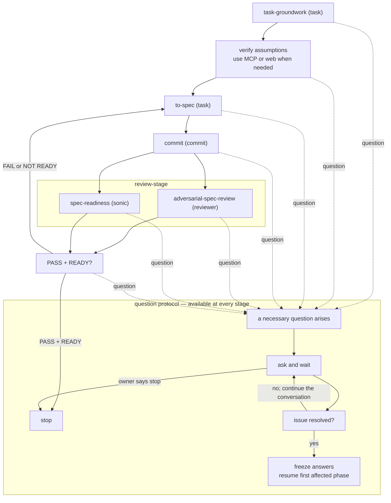

# OMP Task to Spec

OMP parent spec gate. Constrains `orchestrate`; does not replace it. The
word `orchestrate` in this file is not a trigger. Children do not read this
skill. This skill is not `to-spec`.

Stop when the same committed spec revision has adversarial PASS and readiness
READY. Implementation, PR, and merge are out of scope. This is spec work: do
not implement even if a named spec exists, and do not skip `to-spec` when
groundwork says the task is already narrow.

Read `references/outcome-lock.md`. Carry the frozen boundary on every spawn.
Do not paste that reference into a child.

## Convergence

This is an evidence-bounded convergence loop, not a round ladder. Apply no
numeric review or rewrite limit. Every rewrite keeps the same spec identity and
invalidates both prior verdicts.

## Agents

Use these OMP agent types:

- `task-groundwork` and `to-spec` → `task`
- `adversarial-spec-review` → `reviewer`
- `spec-readiness` → `sonic` (more mechanical)
- spec commit → `commit`

If `reviewer` or `sonic` is missing, stop before review. Do not substitute
`reviewer` with `task`.

## Rules

Standing rules. Carry them on every spawn with the frozen boundary. They are
not task-specific bans.

- **Verify, do not assume.** Treat assumptions as dangerous. Use the
  authoritative source appropriate to the claim; use MCP or web search when
  needed. Do not leave a decision-bearing assumption unresolved.
- **No UX change without owner permission.** Preserve the current system
  when it already does the job. Before proposing work, inspect how that
  job is done today and call that path. A new surface or flow needs owner
  permission; it is not local implementation freedom.
- **In-use stack, not factory default.** What this repo installed and
  actually runs is the system to use. The original stack, the textbook stack,
  and a more common library are not. Before a store, query, or API enters
  the spec, find the package and entry already used for that job and call
  it.
- **Ask the human in plain speech.** Questions, stop reasons, and the
  final summary are for a person, not a glossary. Say the choice in
  everyday words and what happens if they pick each option. If they would need
  to ask "what are you saying?", rewrite before sending.
- **Question protocol at every stage.** Parent, child, reviewer, or commit agent
  may raise a necessary question. Preserve its substance, ask in plain speech,
  and wait. Continue the conversation until the issue is resolved or the owner
  chooses `stop`; do not treat the first answer as sufficient when it leaves the
  issue open. Freeze the resolved answers and resume from the earliest phase
  whose output must be regenerated; if no output was invalidated, resume the
  interrupted phase. Do not ask what available evidence can decide, and do not
  silently answer or discard another agent's question.

## Spawn

Every spawn carries exact authority, the frozen boundary, and the rules above.
The parent adds no task-specific bans or commentary.

- The parent preserves a child's concrete question, evidence, viable choices,
  and consequences, but does not decide for the human. Asking pauses this run;
  it does not end it or require a new `omp-task-to-spec` call.
- After resolution, route by invalidation: changed task outcome, scope, owner,
  or Outcome lock → `task-groundwork`; changed or incomplete spec contract →
  `to-spec`; commit-only issue → `commit`; review-only issue with unchanged
  committed artifacts → the affected review. If nothing was invalidated,
  resume the interrupted phase. Stop only on PASS + READY, owner `stop`, or a
  missing `reviewer`/`sonic`.
- Carry artifacts and complete reports. Do not summarize or filter.
- Only `to-spec` writes spec bytes. Parent, reviewer, and ad-hoc fix-up do
  not. Reviews are read-only. OMP "trivial inline" does not apply to spec.
- Todos only for the active phase. Do not preallocate numbered review rounds.

## Pair

Every pair is parallel and isolated. Gate is PASS and READY together against
the same committed spec revision. The parent does not force incremental.

- PASS + READY → stop. No rewrite. Reviews score the committed spec; do
  not review uncommitted spec bytes.
- After any FAIL/NOT READY, read both complete reports before rewriting. If
  either raises a necessary question, enter the question protocol first. Once
  resolved, route from the first affected phase using the invalidation rule
  above.
- If no question remains and `Next: to-spec`, pass both complete reports to
  `to-spec`, same spec identity. Require one root-complete rewrite operation
  that closes every current in-lock root family, commit it, then rerun both
  gates. Continue while current evidence proves a P0/P1 or structural Blocker;
  do not stop or continue because of the number of prior reviews.
- Unsupported child-owned architecture or a parallel machine whose removal or
  existing owner/path is already decided by the frozen lock → `to-spec`; do
  not ask.
  Missing or contradictory authority for a real lock enlargement, durable
  store, or create/replace/cancel choice → question protocol. A reviewer's
  opinion is not that authority.
- A groundwork question uses the same protocol. After resolution, rerun
  `task-groundwork` when its authority changed; otherwise continue from the
  interrupted point.

## Spec commit

This skill authorizes a spec commit via `commit` + `commit-work` after
each completed `to-spec` write, before the next review pair. Inspect the exact
`to-spec` output before committing. If it raises a question, enter the question
protocol and do not commit. After resolution, rerun `task-groundwork` or
`to-spec` when the answer invalidated their artifact; otherwise resume the
commit. Reviews measure the committed spec. No further commit after PASS +
READY or after owner `stop`.

## Final summary

Plain speech, same bar as the ask rule. Purpose, boundary, ready?, used the
existing path or built a second one, absorbed neighboring work, open choice.
No file, table, lifecycle list, or glossary.
