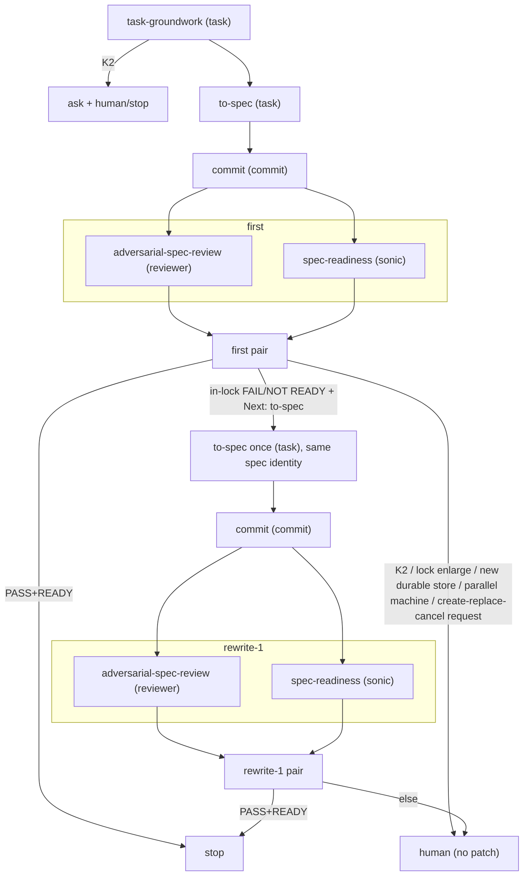

# OMP Task to Spec

OMP parent spec gate. Constrains `orchestrate`; does not replace it. The
word `orchestrate` in this file is not a trigger. Children do not read this
skill. This skill is not `to-spec`.

Stop when the spec is READY. Implementation, PR, and merge are out of
scope. This is spec work: do not implement even if a named spec exists, and
do not skip `to-spec` when groundwork says the task is already narrow.

Read `references/outcome-lock.md`. Carry the four lanes on every spawn. Do
not paste that essay into a child.

## Cycle

Cycle is `first | rewrite-1 | stop`. No third rewrite.

## Agents

OMP agent types, not model roles (`TASK` / `SLOW` / `DEFAULT`):

- `task-groundwork` and `to-spec` → `task`
- `adversarial-spec-review` → `reviewer`
- `spec-readiness` → `sonic` (more mechanical)
- spec commit → `commit`

If `reviewer` or `sonic` is missing, stop before review. Do not substitute
`reviewer` with `task`.

## Spawn

Every spawn carries exact authority and the frozen four lanes. The parent
adds no bans or commentary. **Call ≠ swallow.**

- K2 options are only `call-substrate` / `own-in-child` / `defer-new-child` /
  `stop`. Pass them through `ask`. The parent does not decide.
- Carry artifacts and complete reports. Do not summarize or filter.
- Only `to-spec` writes spec bytes. Parent, reviewer, and ad-hoc fix-up do
  not. Reviews are read-only. OMP "trivial inline" does not apply to spec.
- Todos only for the active phase. Do not open `rewrite-1` until the first
  pair fails in-lock.

## Pair

First pair is parallel, isolated, cycle `first`. Gate is PASS and READY
together. The parent does not force incremental.

- PASS + READY → stop. No rewrite. Reviews score the committed spec; do
  not review uncommitted spec bytes.
- In-lock FAIL/NOT READY and `Next: to-spec` → both complete reports to
  `to-spec` once, same spec identity; commit that write; then the same
  pair as `rewrite-1`.
- Architecture, lock enlargement, a new durable store, or a
  create/replace/cancel *request* → human. No patch. A reviewer's
  `necessity=` stamp is not that request.
- Groundwork K2 → `ask` + stop. Do not spawn `to-spec`.

## Spec commit

This skill authorizes a spec commit via `commit` + `commit-work` after
each `to-spec` write (first or the one rewrite), before that cycle's
review pair. Reviews measure the committed spec. No second commit after
PASS+READY. No commit on K2 or stop.

## Final summary

Non-technical. Purpose, boundary, ready?, substrate called vs a second
machine, sibling overrun, open K2. No file, table, or lifecycle list.
