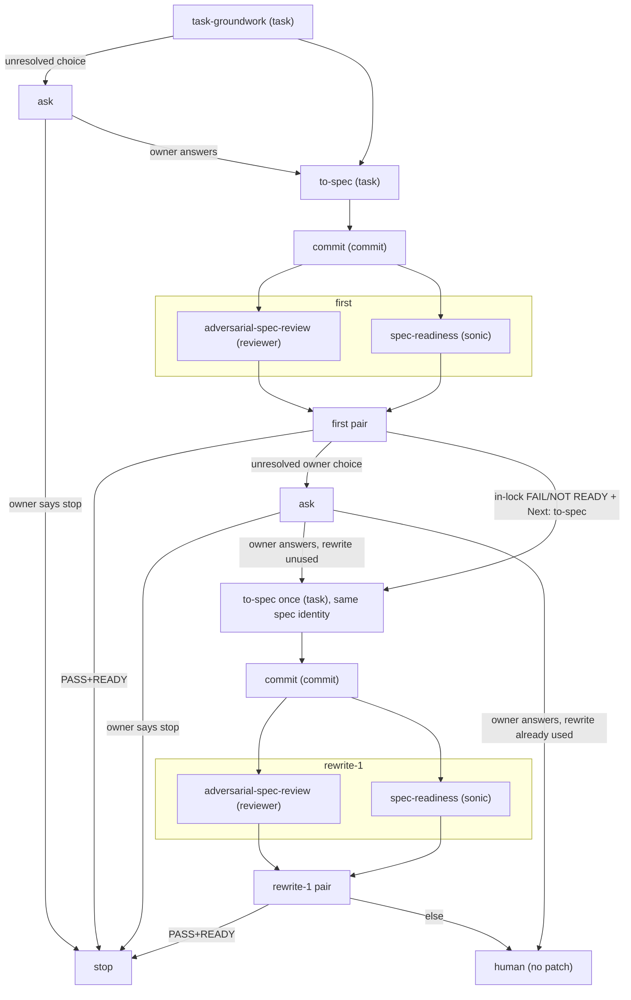

# OMP Task to Spec

OMP parent spec gate. Constrains `orchestrate`; does not replace it. The
word `orchestrate` in this file is not a trigger. Children do not read this
skill. This skill is not `to-spec`.

Stop when the spec is READY. Implementation, PR, and merge are out of
scope. This is spec work: do not implement even if a named spec exists, and
do not skip `to-spec` when groundwork says the task is already narrow.

Read `references/outcome-lock.md`. Carry the four lanes on every spawn. Do
not paste that essay into a child.

## Cycle

Cycle is `first | rewrite-1 | stop`. No third rewrite.

## Agents

OMP agent types, not model roles (`TASK` / `SLOW` / `DEFAULT`):

- `task-groundwork` and `to-spec` → `task`
- `adversarial-spec-review` → `reviewer`
- `spec-readiness` → `sonic` (more mechanical)
- spec commit → `commit`

If `reviewer` or `sonic` is missing, stop before review. Do not substitute
`reviewer` with `task`.

## Rules

Standing rules. Carry them on every spawn with the four lanes. They are
not task-specific substrate bans.

- **Verify, do not assume.** Treat assumptions as dangerous. Prefer
  verification. Check MCP or web search before a claim enters the lock or
  spec. Unverified assumption is not evidence.
- **No UX change without owner permission.** Preserve the current system
  when it already does the job. Before proposing work, inspect how that
  job is done today and call that path. A new surface or flow needs owner
  permission; it is not K1 freedom.
- **In-use stack, not factory default.** What this repo installed and
  actually runs is the substrate. The original stack, the textbook stack,
  and a more common library are not. Before a store, query, or API enters
  the spec, find the package and entry already used for that job and call
  it. LPG in a petrol-bodied car: fill what they drive, not what the
  badge says.
- **Ask the human in plain speech.** Questions, stop reasons, and the
  final summary are for a person, not a glossary. Say the choice in
  everyday words and what happens if they pick each option. Do not lead
  with kit words (lock, substrate, K2, PI, and the like). Keep the enum
  for the machine. If they would need to ask "what are you saying?",
  rewrite before sending.
- **Ask is a wait, not a stop.** After they answer, continue this same
  run with that answer frozen. Do not end the gate or ask them to start
  a new `omp-task-to-spec` call. Stop only when READY, they pick stop,
  rewrite-1 fails, or `reviewer`/`sonic` is missing.

## Spawn

Every spawn carries exact authority, the frozen four lanes, and the rules
above. The parent adds no task-specific bans or commentary. **Call ≠ swallow.**

- K2 options are only `call-substrate` / `own-in-child` / `defer-new-child` /
  `stop`. Pass them through `ask` in plain speech. The parent does not
  decide. Ask is a wait, not a stop. After they answer, freeze that
  answer as authority and continue this same run. Do not tell them to
  start a new `omp-task-to-spec` call. Stop the gate only when READY,
  they pick `stop`, rewrite-1 fails, or `reviewer`/`sonic` is missing.
- Carry artifacts and complete reports. Do not summarize or filter.
- Only `to-spec` writes spec bytes. Parent, reviewer, and ad-hoc fix-up do
  not. Reviews are read-only. OMP "trivial inline" does not apply to spec.
- Todos only for the active phase. Do not open `rewrite-1` until the first
  pair fails in-lock.

## Pair

First pair is parallel, isolated, cycle `first`. Gate is PASS and READY
together. The parent does not force incremental.

- PASS + READY → stop. No rewrite. Reviews score the committed spec; do
  not review uncommitted spec bytes.
- In-lock FAIL/NOT READY and `Next: to-spec` → both complete reports to
  `to-spec` once, same spec identity; commit that write; then the same
  pair as `rewrite-1`.
- Architecture, lock enlargement, a new durable store, or a
  create/replace/cancel *request* without an owner answer → `ask`. Do
  not patch. A reviewer's `necessity=` stamp is not that answer. After
  they answer, continue this run; do not treat the answer as a new
  reason to stop.
- Groundwork unresolved choice → `ask`, then `to-spec` with the answer.
  Do not stop the gate.

## Spec commit

This skill authorizes a spec commit via `commit` + `commit-work` after
each `to-spec` write (first or the one rewrite), before that cycle's
review pair. Reviews measure the committed spec. No second commit after
PASS+READY. No commit while a question is unanswered, or after they
pick `stop`.

## Final summary

Plain speech, same bar as the ask rule. Purpose, boundary, ready?,
called the existing path or built a second one, stepped on a neighbor,
open choice. No file, table, lifecycle list, or kit glossary.
